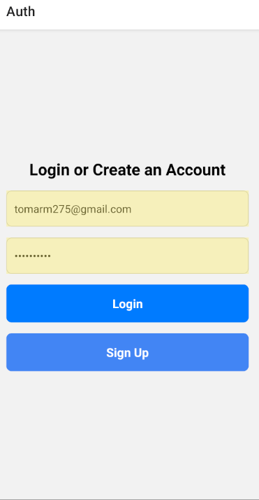
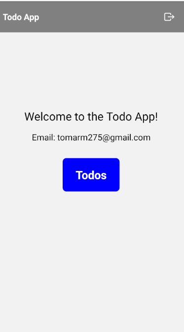
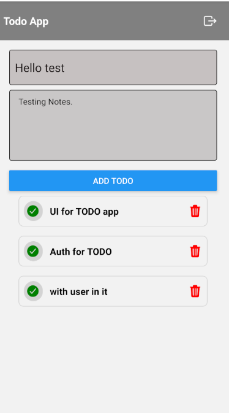
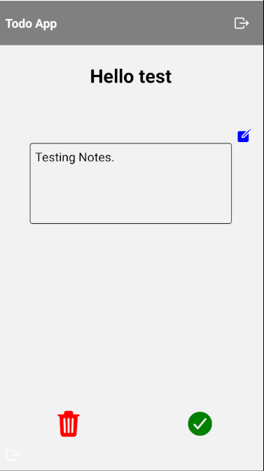

# TODO :React-Native [Firebase]

<p>
  <!-- iOS -->
  <a href="https://itunes.apple.com/app/apple-store/id982107779">
    
  </a>
  <!-- Android -->
  <a href="https://play.google.com/store/apps/details?id=host.exp.exponent&referrer=blankexample">
    
  </a>
  <!-- Web -->
  <a href="https://docs.expo.dev/workflow/web/">
    
  </a>
</p>

## 🚀 How to use

```bash
# Install dependencies
yarn install
# Start the Server
yarn android # for android
yarn ios # for ios
yarn web # for web
yarn dev # tunnel
yarn start # lan
```

### ✨ Features

* User authentication with Firebase.
* Create, edit, delete, and mark tasks as done.
* Real-time updates with Firestore.
* Offline support.

### 🌐 App Screenshots

<!-- image from local -->





